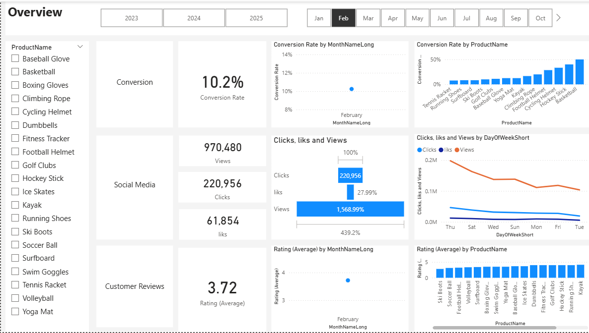
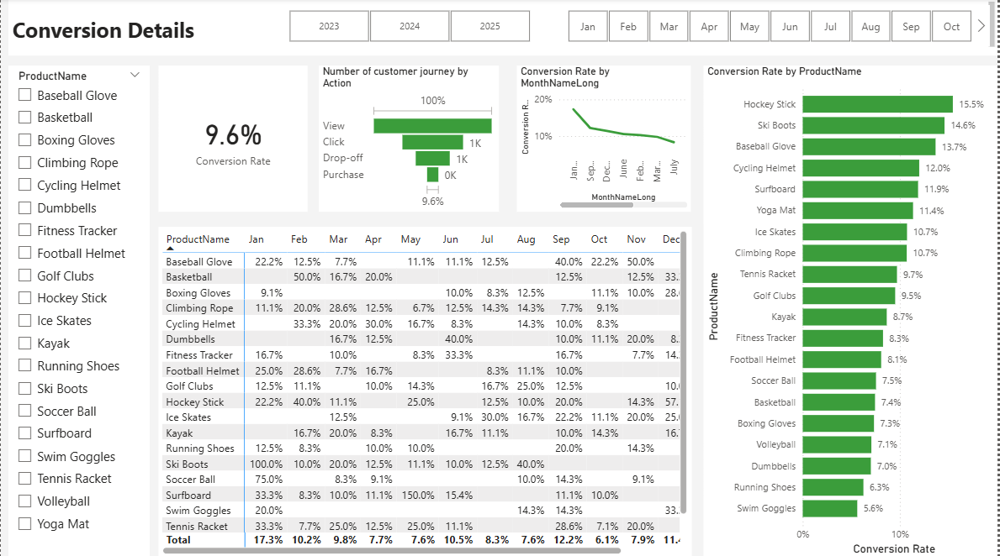
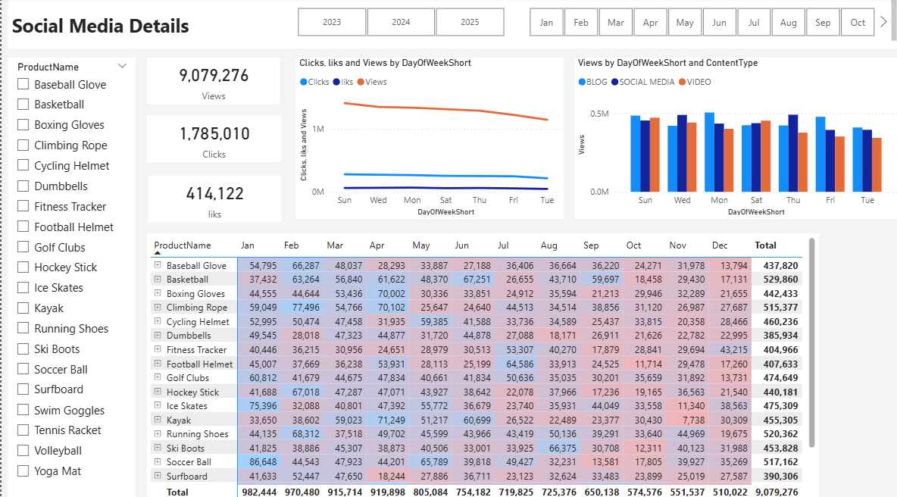
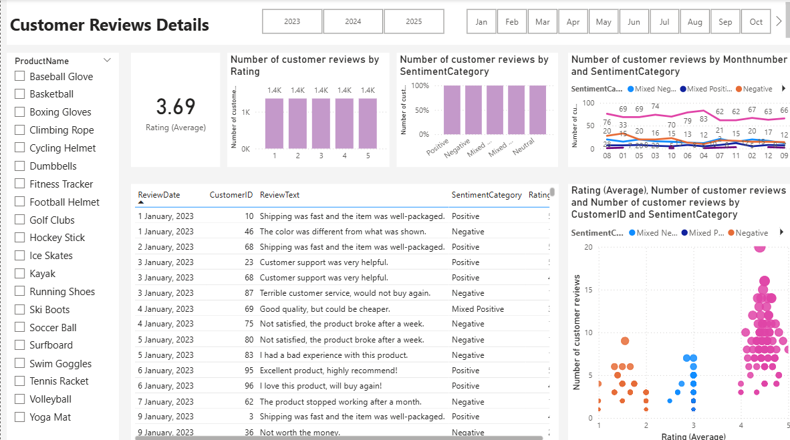

# Marketing-Analytics
## Overview

This project demonstrates an end-to-end marketing analytics workflow using SQL, Python, and Power BI.

The objective was to transform raw marketing and customer review data into actionable insights that help evaluate campaign performance, customer engagement, conversion rates, and customer sentiment.

The project combines data cleaning and transformation in SQL, sentiment analysis in Python, and interactive reporting in Power BI.

## Business Objectives

* Analyze customer engagement across marketing channels
* Measure conversion performance
* Evaluate social media interactions
* Understand customer sentiment through review analysis
* Create an interactive dashboard for business decision-making

## Tools & Technologies

* SQL Server
* Python
* Pandas
* NLTK VADER Sentiment Analysis
* Jupyter Notebook
* Power BI
* Git & GitHub

## Dataset Overview

The project integrates multiple datasets covering:

### Customer Journey Data

Tracks customer interactions throughout the marketing funnel.

### Engagement Data

Captures user engagement metrics such as views, clicks, and likes.

### Product Data

Contains product information used for performance analysis.

### Customer Data

Provides customer-level attributes for segmentation and reporting.

### Customer Reviews Dataset

Customer reviews were enriched using sentiment analysis and exported to:

```text
fact_customer_reviews_with_sentiment.csv
```

The final dataset contains:

| Column            | Description                |
| ----------------- | -------------------------- |
| ReviewID          | Unique review identifier   |
| CustomerID        | Customer identifier        |
| ProductID         | Product identifier         |
| ReviewDate        | Review submission date     |
| Rating            | Customer rating            |
| ReviewText        | Original review text       |
| SentimentScore    | Calculated sentiment score |
| SentimentCategory | Sentiment classification   |
| SentimentBucket   | Grouped sentiment category |

## Project Workflow

### 1. Data Cleaning & Transformation (SQL)

* Cleaned and standardized source datasets
* Removed inconsistencies and formatting issues
* Prepared analytical tables for reporting
* Structured data for dashboard development

### 2. Sentiment Analysis (Python)

* Processed customer review text
* Applied VADER sentiment analysis
* Generated sentiment scores
* Categorized reviews into sentiment groups
* Exported enriched review data for reporting

### 3. Dashboard Development (Power BI)

Created an interactive dashboard to analyze:

* Customer Engagement
* Conversion Performance
* Social Media Activity
* Customer Reviews & Sentiment

## Dashboard Preview

### Overview



### Conversion Details



### Social Media Details



### Customer Review Details



## Repository Structure

```text
Marketing-Analytics/
│
├── dashboards/
│
├── data/
│   └── fact_customer_reviews_with_sentiment.csv
│
├── images/
│   ├── overview.png
│   ├── conversion_details.png
│   ├── social_media_details.png
│   └── customer_review_details.png
│
├── notebooks/
│
├── sql/
│
└── README.md
```

## Skills Demonstrated

* SQL Data Cleaning
* Data Transformation
* Data Modeling
* Python Data Analysis
* Sentiment Analysis
* Data Visualization
* Dashboard Design
* Business Intelligence Reporting
* GitHub Project Documentation

## Author

Omnia Taha Awad

Software Engineering Graduate transitioning into Data Analytics with a focus on SQL, Python, Power BI, and data-driven decision making.
